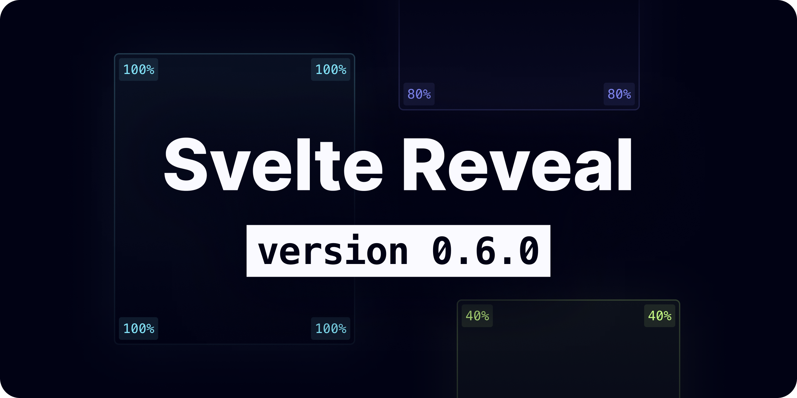

# svelte-reveal

[](https://github.com/DaveKeehl/svelte-reveal/actions/workflows/main.yml)    [](https://codecov.io/gh/DaveKeehl/svelte-reveal)[](https://gitpod.io/#https://github.com/DaveKeehl/svelte-reveal/tree/develop)

> ⚠️&nbsp;&nbsp;svelte-reveal is currently in beta. Do you want to [contribute](https://github.com/DaveKeehl/svelte-reveal/issues)? Do you want to [report a bug](https://github.com/DaveKeehl/svelte-reveal/issues/new?assignees=&labels=bug&template=bug_report.yml&title=%5BBug%5D%3A+)?

svelte-reveal is a library created with the purpose of helping [Svelte](https://svelte.dev/) users add reveal on scroll animations to their web applications in the easiest way possible. This library leverages the [Intersection Observer API](https://developer.mozilla.org/en-US/docs/Web/API/Intersection_Observer_API) in order to know when to trigger the animations.

## Features

- Zero config Svelte action
- Highly customizable transitions
- Integrates a performant intersection observer
- TypeScript ready

## Table of Contents

1. [Usage](#usage)
1. [Demo](#demo)
1. [Why svelte-reveal](#why-svelte-reveal)
1. [SvelteKit](#sveltekit)
1. [Options](#options)
1. [Global config](#global-config)
1. [API](#api)
1. [Suggestions](#suggestions)
1. [Troubleshooting](#troubleshooting)
1. [Funding](#funding)
1. [Versioning](#versioning)
1. [Changelog](#changelog)
1. [License](#license)

## Usage

1. Install the library. You can use either [npm](https://www.npmjs.com/):

   ```bash
   npm install -D svelte-reveal
   ```

   [yarn](https://yarnpkg.com/):

   ```bash
   yarn add -D svelte-reveal
   ```

   or [pnpm](https://pnpm.io/):

   ```bash
   pnpm add -D svelte-reveal
   ```

2. Import the library within your Svelte component:

   ```html
   <script>
     import { reveal } from 'svelte-reveal';
   </script>
   ```

3. Add the imported reveal action to any DOM element you want:

   ```html
   <h1 use:reveal>Your title</h1>
   <p use:reveal={{ transition: "fade" }}>A paragraph</p>
   ```

   If you want to use the action on a Svelte component, you need to pass the reveal options via props:

   ```html
   // App.svelte
   <script>
     import Heading from './Heading.svelte';
   </script>
   
   <Heading useReveal={{ transition: "fade" }}>Hello world</Heading>
   
   // Heading.svelte
   <script lang="ts">
     import { reveal } from 'svelte-reveal';
     import type { RevealOptions } from 'svelte-reveal';
     export let useReveal: RevealOptions;
   </script>
   
   <h1 use:reveal={ useReveal }>
     <slot />
   </h1>
   ```
   
   Using [SvelteKit](https://kit.svelte.dev/)? Please read [section "SvelteKit"](#sveltekit)

### Docker

A Docker image is also available on [DockerHub](https://hub.docker.com/):

```bash
docker pull davekeehl/svelte-reveal:latest
```

You can also use the provided Dockerfile in the repository as a development environment. You can read more [here](https://code.visualstudio.com/docs/remote/containers).

## Demo

In this [Svelte REPL](https://svelte.dev/repl/1cf37b0947ac46b8ae9cc791abda7159?version=3.44.1) I created you can see svelte-reveal in action.

## Why svelte-reveal

If you happened to scout the internet for other similar libraries, you would have noticed that other authors have decided to create their own library using Svelte [slots](https://svelte.dev/docs#slot) (similar to [React children](https://reactjs.org/docs/composition-vs-inheritance.html)). There is nothing wrong with that approach, but in my opinion it goes a bit against one of Svelte's core purpose: writing more concise code. Having to wrap every to-be-transitioned component adds 2 extra lines of code each time, making your files unnecessarily bloated for such a simple add-on.

You might have also noticed people adding event listeners to the window object in order to transition elements, but in terms of performance it [doesn't scale very well](https://itnext.io/1v1-scroll-listener-vs-intersection-observers-469a26ab9eb6).

Instead, I decided to use Svelte [actions](https://svelte.dev/docs#use_action), which are functions you can attach to a DOM element and that allow you to get access to that particular element and hook into its lifecycle. They take up considerably fewer lines of code, and so far I haven't encountered any obstacle or performance drawback. Morever, this library is backed by the Intersection Observer API, which is great for performance.

## SvelteKit

The way svelte-reveal transitions the elements does not work well with [SSR](https://kit.svelte.dev/docs/page-options#ssr), which is enabled by default on SvelteKit. One way to get around this issue, is to wrap your top-most element or component in your app inside an if-block that is evaluated to `true` only when its context has been updated, as in the following example.

```html
<script>
  import { afterUpdate } from 'svelte';

  let show = false;

  afterUpdate(() => {
    show = true;
  });
</script>

{#if show}
  <your-element-or-component />
{/if}
```

Please [create a new issue](https://github.com/DaveKeehl/svelte-reveal/issues/new/choose) and submit a bug report in case of problems.

## Options

Depending on the use case, you can either use this library as-is (which applies some [default styles](https://github.com/DaveKeehl/svelte-reveal/blob/main/src/internal/config.ts#L6-L37)), or customize it to your liking. If you choose to do so, you can pass an object to this action containing your own options to be applied.

Keep in mind that these options are applied to the single DOM element you add svelte-reveal to. For global and more in-depth settings, refer to the [API](#api) section.

| Name           | Type                                 | Default                  | Description                                                  |
| -------------- | ------------------------------------ | ------------------------ | ------------------------------------------------------------ |
| disable        | `boolean`                            | `false`                  | It enables/disables the transition.                          |
| debug          | `boolean`                            | `false`                  | It enables/disables debugging mode for the targeted DOM element. This will log all options and configs to the console.<br />In order to be able to use this mode, you are required to also set the `ref` property. |
| ref            | `string`                             | `""`                     | When `debug` is set to `true`, you are required to specificy a `ref` string. When multiple DOM nodes have `debug` mode enabled, `ref` strings allow you to know to which DOM node a console log statement belongs to. |
| highlightLogs  | `boolean`                            | `false`                  | When set to `true` the console logs of the target node get colored, making it easier to see them quicker among many other logs. |
| highlightColor | `string`                             | `"tomato"`               | You can use this option to tweak the console logs color when `highlightLogs` is set to `true`. |
| root           | `IntersectionObserver['root']`       | `null`                   | The [root](https://developer.mozilla.org/en-US/docs/Web/API/IntersectionObserver/root) element used by the Intersection Observer API. |
| rootMargin     | `IntersectionObserver['rootMargin']` | `"0px 0px 0px 0px"`      | The [rootMargin](https://developer.mozilla.org/en-US/docs/Web/API/IntersectionObserver/rootMargin) property used by the Intersection Observer API. |
| threshold      | `number`                             | `0.6`                    | The [threshold](https://developer.mozilla.org/en-US/docs/Web/API/IntersectionObserver/IntersectionObserver) (in percentage from `0.0` to `1.0`) property used by the Intersection Observer API to know when its target element is considered visible or not. |
| transition     | `string`                             | `"fly"`                  | The animation that will be triggered when your target node becomes visible.<br />Read more [in this subsection](#transitions) for a comprehensive explanation of the full list of available transitions. |
| reset          | `boolean`                            | `false`                  | When set to true, the node transitions out when it's out of view.<br /><br />⚠️ Be careful not to overuse this option, as it prevents the Intersection Observer to stop observing the target node. Performance is therefore not guaranteed when many elements have reset set to `true`. |
| delay          | `number`                             | `0`                      | The amount of milliseconds (_ms_) you want to delay a given transition. |
| duration       | `number`                             | `800`                    | The amount of milliseconds (_ms_) you want a given transition to last. |
| easing         | `string`                             | `"custom"`               | The type of easing function you want to apply to a given element.<br />[Check out](https://github.com/DaveKeehl/svelte-reveal/blob/main/src/internal/types.ts#L231-L257) the full list of available easing functions.<br />The default easing function used by svelte-reveal corresponds to the [CSS ease transition timing function](https://developer.mozilla.org/en-US/docs/Web/CSS/transition-timing-function#values). |
| customEasing   | `CustomEasing`                       | `[0.25, 0.1, 0.25, 0.1]` | The individual weights of a custom cubic-bezier curve. [This website](https://cubic-bezier.com/) is great for previewing timing functions. |
| x              | `number`                             | `-20`                    | The starting offset position in pixels (_px_) on the x-axis of the `"slide"` transition.<br />If `x` is negative, the element will transition from the left, else from the right. |
| y              | `number`                             | `-20`                    | The starting offset position in pixels (_px_) on the y-axis of the `"fly"` transition.<br />If `y` is negative, the element will transition from the top, else from the bottom. |
| rotate         | `number`                             | `-360`                   | The starting rotation angle in degrees (_deg_) along the x-axis you want your node to rotate from when being revealed with the `"spin"` transition.<br />If `rotate` is positive, the element will spin clockwise, else counter-clockwise. |
| opacity        | `number`                             | `0`                      | The starting opacity value in percentage (_%_) of any transition. It can be a number between `0.0` and `1.0`. |
| blur           | `number`                             | `16`                     | The starting blur value in pixels (_px_) of the `"blur"` transition. |
| scale          | `number`                             | `0`                      | The starting scale value in percentage (_%_) of the `"scale"` transition. |

### Transitions

The following are all the transitions available by svelte-reveal. The names listed in the table match the ones available in your source code. All transitions have the fade transition backed in.

| Name  | Description                                                  |
| ----- | ------------------------------------------------------------ |
| fade  | The element fades in gracefully.<br />In practice: `opacity: 0 -> 1` |
| fly   | The element fades in and performs a translation on the y-axis (vertical).<br />In practice: `opacity: 0 -> 1` and `transform: translateY(-20px -> 0px) ` |
| slide | The element fades in and performs a translation on the x-axis (horizontal).<br />In practice: `opacity: 0 -> 1` and `transform: translateX(-20px -> 0px)` |
| blur  | The element fades in and becomes unblurred.<br />In practice: `opacity: 0 -> 1` and `filter: blur(8px -> 0px)` |
| scale | The element fades in and gets to the original size.<br />In practice: `opacity: 0 -> 1` and `transform: scale(0 -> 1)`<br /><br />⚠️ In order to use this transition it is required to use the `width` CSS property on the element to reveal. If you are not already using this property for other things, you can set it to `width: fit-content` . |
| spin  | The element fades in and gets to the original rotation degree.<br />In practice: `opacity: 0 -> 1` and `transform: rotate(-360 -> 0)`<br /><br />⚠️ In order to use this transition it is required to use the `width` CSS property on the element to reveal. If you are not already using this property for other things, you can use set it to `width: fit-content` . |

### Callbacks

Among the available options, there are also some callback functions you can leverage to inject code during specific moments of the lifecycle of the DOM node attached to this action.

| Name          | Args                  | Return | Description                                                                                                |
| ------------- | --------------------- | ------ | ---------------------------------------------------------------------------------------------------------- |
| onRevealStart | `(node: HTMLElement)` | `void` | Function that gets fired when the node starts being revealed.                                              |
| onRevealEnd   | `(node: HTMLElement)` | `void` | Function that gets fired when the node is fully revealed.                                                  |
| onResetStart  | `(node: HTMLElement)` | `void` | Function that gets fired when the `reset` option is set to `true` and the node starts transitioning out.   |
| onResetEnd    | `(node: HTMLElement)` | `void` | Function that gets fired when the `reset` option is set to `true` and the node has fully transitioned out. |
| onMount       | `(node: HTMLElement)` | `void` | Function that gets fired when the node is mounted on the DOM.                                              |
| onUpdate      | `(node: HTMLElement)` | `void` | Function that gets fired when the action options are updated.                                              |
| onDestroy     | `(node: HTMLElement)` | `void` | Function that gets fired when the node is unmounted from the DOM.                                          |

## Global config

This library is globally configured as follows right of out the box:

| Parameter  | (children) | (children) | Type               | Default             | Description                                                                                                                         |
| ---------- | ---------- | ---------- | ------------------ | ------------------- | ----------------------------------------------------------------------------------------------------------------------------------- |
| dev        |            |            | `boolean`          | `true`              | Globally enables/disables all logs.                                                                                                 |
| once       |            |            | `boolean`          | `false`             | Runs the scroll animations only once when set to `true`. When set to `true`, refreshing the page doesn't re-run them.               |
| responsive |            |            | `Responsive`       |                     | Information about how the library should handle responsiveness. It can be used to enable/disable the scroll effect on some devices. |
|            | mobile     |            | `IDevice`          |                     | Object containing information about responsiveness on mobile devices.                                                               |
|            |            | enabled    | `boolean`          | `true`              | Whether the device supports the scroll effect on mobile devices.                                                                    |
|            |            | breakpoint | `number`           | `425`               | The viewport width upper limit that a mobile device can be targeted to work in.                                                     |
|            | tablet     |            | `IDevice`          |                     | Object containing information about responsiveness on tablet devices.                                                               |
|            |            | enabled    | `boolean`          | `true`              | Whether the device supports the scroll effect on tablet devices.                                                                    |
|            |            | breakpoint | `number`           | `768`               | The viewport width upper limit that a tablet device can be targeted to work in.                                                     |
|            | laptop     |            | `IDevice`          |                     | Object containing information about responsiveness on laptop devices.                                                               |
|            |            | enabled    | `boolean`          | `true`              | Whether the device supports the scroll effect on laptop devices.                                                                    |
|            |            | breakpoint | `number`           | `1440`              | The viewport width upper limit that a laptop device can be targeted to work in.                                                     |
|            | desktop    |            | `IDevice`          |                     | Object containing information about responsiveness on desktop devices.                                                              |
|            |            | enabled    | `boolean`          | `true`              | Whether the device supports the scroll effect on desktop devices.                                                                   |
|            |            | breakpoint | `number`           | `2560`              | The viewport width upper limit that a desktop device can be targeted to work in.                                                    |

## API

> ⚠️ If you want to customise the behavior of a single DOM node, you are supposed to use the [options](#options).

svelte-reveal also exposes several functions you can call to change the [default options]() and [global configuration](#global-config) of this library. Since these functions operate on a global level across all components using svelte-reveal, you are supposed to only call them from a single file, otherwise you'll keep overriding the default options and global config from multiple points. 

If you need/want to considerably customize the behavior of this library, I suggest creating a dedicated file (e.g. [reveal.config.js](https://github.com/DaveKeehl/svelte-reveal/blob/main/example/reveal.config.js)) and to import it from the top-most component in the components tree of your project. Within that file you can then call the API functions to set global settings or shared transition properties.

```html
// App.svelte

<script>
  import '../reveal.config';
</script>

<div>{ your markup goes here }</div>
```

Since this library has been built using [TypeScript](https://www.typescriptlang.org/), there are many custom types used throughout the entire codebase. The following types are the main ones used by the API:

```typescript
type Device = 'mobile' | 'tablet' | 'laptop' | 'desktop';

interface IDevice {
  enabled: boolean;
  breakpoint: number;
}

interface Responsive {
  [P in Device]: IDevice;
}

interface IObserverOptions {
  root: IntersectionObserver['root'];
  rootMargin: IntersectionObserver['rootMargin'];
  threshold: number;
}

interface RevealConfig {
  dev: boolean;
  once: boolean;
  responsive: Responsive;
}

interface RevealConfig {
  disable?: boolean;
  debug?: boolean;
  ref?: string;
  highlightLogs?: boolean;
  highlightColor?: string;
  root?: IntersectionObserver['root'];
  rootMargin?: IntersectionObserver['rootMargin'];
  threshold?: number;
  ...
  onUpdate?: (node: HTMLElement) => void;
  onDestroy?: (node: HTMLElement) => void;
}
```

### setDev

| Args             | Return         | Description                         |
| ---------------- | -------------- | ----------------------------------- |
| `(dev: boolean)` | `RevealConfig` | Globally enables/disables all logs. |

### setOnce

| Args              | Return         | Description                                                  |
| ----------------- | -------------- | ------------------------------------------------------------ |
| `(once: boolean)` | `RevealConfig` | Runs the scroll animations only once when set to true. Refreshing the page doesn't re-run them. |

### setDeviceStatus

| Args                                | Return         | Description                  |
| ----------------------------------- | -------------- | ---------------------------- |
| `(device: Device, status: boolean)` | `RevealConfig` | Sets the status of a device. |

### setDevicesStatus

| Args                                   | Return         | Description                          |
| -------------------------------------- | -------------- | ------------------------------------ |
| `(devices: Device[], status: boolean)` | `RevealConfig` | Sets the status of multiple devices. |

### setDeviceBreakpoint

| Args                                   | Return         | Description                      |
| -------------------------------------- | -------------- | -------------------------------- |
| `(device: Device, breakpoint: number)` | `RevealConfig` | Sets the breakpoint of a device. |

### setDevice

| Args                                  | Return         | Description                               |
| ------------------------------------- | -------------- | ----------------------------------------- |
| `(device: Device, settings: IDevice)` | `RevealConfig` | Updates the settings of a type of device. |

### setResponsive

| Args                       | Return         | Description                                            |
| -------------------------- | -------------- | ------------------------------------------------------ |
| `(responsive: Responsive)` | `RevealConfig` | Sets the responsive property within the config object. |

### setObserverRoot

| Args                                   | Return             | Description                                               |
| -------------------------------------- | ------------------ | --------------------------------------------------------- |
| `(root: IntersectionObserver['root'])` | `IObserverOptions` | Globally sets the Intersection Observer API root element. |

### setObserverRootMargin

| Args                                               | Return             | Description                                                  |
| -------------------------------------------------- | ------------------ | ------------------------------------------------------------ |
| `(rootMargin: IntersectionObserver['rootMargin'])` | `IObserverOptions` | Globally sets the Intersection Observer API rootMargin property. |

### setObserverThreshold

| Args                  | Return             | Description                                                  |
| --------------------- | ------------------ | ------------------------------------------------------------ |
| `(threshold: number)` | `IObserverOptions` | Globally sets the Intersection Observer API threshold property. |

### setObserverConfig

| Args                                 | Return             | Description                                      |
| ------------------------------------ | ------------------ | ------------------------------------------------ |
| `(observerConfig: IObserverOptions)` | `IObserverOptions` | Globally sets the Intersection Observer options. |

### setConfig

| Args                         | Return         | Description                                                  |
| ---------------------------- | -------------- | ------------------------------------------------------------ |
| `(userConfig: RevealConfig)` | `RevealConfig` | By passing an object of type `RevealConfig` you can have full control over all the internal properties. |

### setDefaultOptions

| Args                       | Return          | Description                                                                                                                                                                                                                    |
| -------------------------- | --------------- | ------------------------------------------------------------------------------------------------------------------------------------------------------------------------------------------------------------------------------ |
| `(options: RevealOptions)` | `RevealOptions` | You can use this function to override the global default options of the reveal effect. It can be useful when you want a specific option for many elements, so that you don't have to change it for every element individually. |

## Suggestions

It's not by any means required, but in order to take full advantage of this library, I suggest creating some environment variables to keep track of the environment the application is currently in (e.g. development, production) and to leverage NPM scripts to update those variables. [This article](https://www.twilio.com/blog/working-with-environment-variables-in-node-js-html) explains well this concept.

That way you can for example set the config `dev` property to `false` when in production and avoid exposing console logs to the end users.

If you use [SvelteKit](https://kit.svelte.dev/) you can import the `dev` variable from the [$app/environment](https://kit.svelte.dev/docs/modules#$app-environment-dev) module. If you are using [Vite](https://vitejs.dev/), you can use the `import.meta.env.DEV` available from its [env variables and modes](https://vitejs.dev/guide/env-and-mode.html#env-variables-and-modes).

## Troubleshooting

Feel free to [open a new issue](https://github.com/DaveKeehl/svelte-reveal/issues/new/choose) in case of any problems.

## Funding

[Want to buy me a coffee?](https://ko-fi.com/davekeehl)

## Versioning

This project uses [Semantic Versioning](https://semver.org/) to keep track of its version number.

## Changelog

[CHANGELOG](https://github.com/DaveKeehl/svelte-reveal/blob/develop/CHANGELOG.md)

## License

[MIT](https://github.com/DaveKeehl/svelte-reveal/blob/develop/LICENSE)
