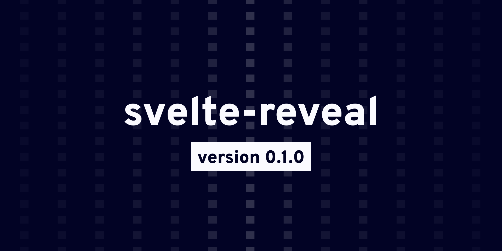

# svelte-reveal

[](https://gitpod.io/#https://github.com/DaveKeehl/svelte-reveal/tree/develop)    [](https://github.com/DaveKeehl/svelte-reveal/actions/workflows/main.yml)    [](https://codecov.io/gh/DaveKeehl/svelte-reveal)

> ⚠️ svelte-reveal is currently in beta. Do you want to [contribute](https://github.com/DaveKeehl/svelte-reveal/issues)? Do you want to [report a bug](https://github.com/DaveKeehl/svelte-reveal/issues)?

svelte-reveal is a library created with the purpose of helping [Svelte](https://svelte.dev/) users add reveal on scroll transitions to their web applications. This library leverages the [Intersection Observer API](https://developer.mozilla.org/en-US/docs/Web/API/Intersection_Observer_API) in order to know when to trigger the animations.

## Table of Content

- [Usage](#Usage)
- [Demo](#Demo)
- [Why svelte-reveal](#Why-svelte-reveal)
- [Options](#Options)
- [Global config](#Global-config)
- [API](#API)
- [Suggestions](#Suggestions)
- [Troubleshooting](#Troubleshooting)
- [Funding](#Funding)
- [Versioning](#Versioning)
- [Changelog](#Changelog)
- [License](#License)


## Usage

1. Install the library. You can use either [npm](https://www.npmjs.com/):

   ```bash
   npm install svelte-reveal --save-dev
   ```

   or [yarn](https://yarnpkg.com/):

   ```````bash
   yarn add -D svelte-reveal
   ```````

2. Import the library within your Svelte component:

   ```html
   <script>
     import { reveal } from 'svelte-reveal';
   </script>
   ```

3. Add the imported reveal action to any DOM element you want:

   ```html
   <h1 use:reveal>Your title</h1>
   <p use:reveal={{ transition: "fade" }}>A paragraph</p>
   ```

   If you want to use the action on a Svelte component you can use props:

   ```html
   // App.svelte
   <script>
     import Heading from './Heading.svelte';
   </script>
   
   <Heading revealConfig={{ transition: "fade" }}>Hello world</Heading>
   
   // Heading.svelte
   <script>
     import { reveal } from 'svelte-reveal';
     export let revealConfig;
   </script>
   
   <h1 use:reveal={ revealConfig }>
     <slot />
   </h1>
   ```

   

A Docker image is also available on [DockerHub](https://hub.docker.com/):

```bash
docker pull davekeehl/svelte-reveal:latest
```


## Demo

I've put together a demo website where I showcase svelte-reveal in action. [Check it out](https://svelte-reveal.netlify.app).


## Why svelte-reveal

If you happened to scout the internet for other similar libraries, you would have noticed that other authors have decided to create their own library using Svelte [slots](https://svelte.dev/docs#slot) (similar to [React children](https://reactjs.org/docs/composition-vs-inheritance.html)). There is nothing wrong with that approach, but in my opinion it goes a bit against one of Svelte's core purposes: writing less code. Having to wrap every to-be-transitioned component adds 2 extra lines of code each time, making your files unnecessarily bloated for such a simple add-on.

You might have also noticed people adding event listeners to the window object, but in terms of performance that [doesn't scale very well](https://itnext.io/1v1-scroll-listener-vs-intersection-observers-469a26ab9eb6).

Instead, I decided to use Svelte [actions](https://svelte.dev/docs#use_action), which are functions you can attach to a DOM element and that allow you to get access to that element and its lifecycle. They take up considerably less space and so far I haven't encounted any obstacle or performance drawback. Morever, this library is backed by the Intersection Observer API, which is great for performance.


## Options

Depending on the use case, you can either use this library as-is (which applies some [default styles](https://github.com/DaveKeehl/svelte-reveal/blob/develop/src/index.ts#L26-L57) I have chosen), or customize it to your liking. If you choose to do so, you can pass to this action an object containing additional options.

Keep in mind that these options are applied to the single DOM element you add svelte-reveal to. For global and more in-depth settings, go to the [API](#API) section.

| Name           | Type               | Default                      | Description                                                  |
| -------------- | ------------------ | ---------------------------- | ------------------------------------------------------------ |
| disable        | ```boolean```      | ```false```                  | It enables/disables the transition.                          |
| debug          | ```boolean```      | ```false```                  | It enables/disables debugging mode for the targeted DOM element. This will log all options and configs to the console.<br />In order to be able to use this mode, you are required to also set the ```ref``` property. |
| ref            | ```string```       | ```""```                     | When ```debug``` is set to ```true```, you are required to specificy a ```ref``` string. When multiple DOM nodes have ```debug``` mode enabled, ```ref``` strings allow you to know to which DOM node a console log statement belongs to. |
| highlightLogs  | ```boolean```      | ```false```                  | When set to ```true``` the console logs of the target node get colored, making it easier to see them quicker among many other logs. |
| highlightColor | ```string```       | ```"tomato"```               | You can use this option to tweak the console logs when ```highlightLogs``` is set to ```true```. |
| root           | ```ObserverRoot``` | ```null```                   | The [root](https://developer.mozilla.org/en-US/docs/Web/API/IntersectionObserver/root) element used by the Intersection Observer API. |
| marginTop      | ```number```       | ```0```                      | Top margin (in ```px``` or ```%```) of the [rootMargin](https://developer.mozilla.org/en-US/docs/Web/API/IntersectionObserver/rootMargin) property of the Intersection Observer API. |
| marginBottom   | ```number```       | ```0```                      | Bottom margin (in ```px``` or ```%```) of the [rootMargin](https://developer.mozilla.org/en-US/docs/Web/API/IntersectionObserver/rootMargin) property of the Intersection Observer API. |
| marginLeft     | ```number```       | ```0```                      | Left margin (in ```px``` or ```%```) of the [rootMargin](https://developer.mozilla.org/en-US/docs/Web/API/IntersectionObserver/rootMargin) property of the Intersection Observer API. |
| marginRight    | ```number```       | ```0```                      | Right margin (in ```px``` or ```%```) of the [rootMargin](https://developer.mozilla.org/en-US/docs/Web/API/IntersectionObserver/rootMargin) property of the Intersection Observer API. |
| threshold      | ```number```       | ```0.6```                    | The [threshold](https://developer.mozilla.org/en-US/docs/Web/API/IntersectionObserver/IntersectionObserver) (in percentage from ```0.0``` to ```1.0```) property used by the Intersection Observer API to know when its target element is considered visible or not. |
| transition     | ```string```       | ```"fly"```                  | The animation that will be triggered when your target node becomes visible.<br />[Check out](https://github.com/DaveKeehl/svelte-reveal/blob/develop/src/types.ts#L221) the full list of available transitions. |
| reset          | ```boolean```      | ```false```                  | When set to true, the node transitions out when it's out of view from the Intersection Observer.<br /><br />⚠️ Be careful not to overuse this option, as it prevents the Intersection Observer to stop observing the target node. Performance is therefore not guaranteed when many elements have reset set to ```true```. |
| delay          | ```number```       | ```0```                      | The amount of milliseconds (*ms*) you want to delay a given transition. |
| duration       | ```number```       | ```800```                    | The amount of milliseconds (*ms*) you want a given transition to last. |
| easing         | ```string```       | ```"custom"```               | The type of easing function you want to apply to a given element.<br />[Check out](https://github.com/DaveKeehl/svelte-reveal/blob/develop/src/internal/types.ts#L231-L257) the full list of available easing functions.<br />The default easing function used by svelte-reveal corresponds to the [CSS ease transition timing function](https://developer.mozilla.org/en-US/docs/Web/CSS/transition-timing-function#values). |
| customEasing   | ```CustomEasing``` | ```[0.25, 0.1, 0.25, 0.1]``` | The individual weights of a custom cubic-bezier curve. [This website](https://cubic-bezier.com/) is great for previewing timing functions. |
| x              | ```number```       | ```-20```                    | The starting offset position in pixels (*px*) on the x-axis of the ```"slide"``` transition.<br />If ```x``` is negative, the element will transition from the left, else from the right. |
| y              | ```number```       | ```-20```                    | The starting offset position in pixels (*px*) on the y-axis of the ```"fly"``` transition.<br />If ```y``` is negative, the element will transition from the top, else from the bottom. |
| rotate         | ```number```       | ```-360```                   | The starting rotation angle in degrees (*deg*) along the x-axis you want your node to rotate from when being revealed with the ```"spin"``` transition.<br />If ```rotate``` is positive, the element will spin clockwise, else counter-clockwise. |
| opacity        | ```number```       | ```0```                      | The starting opacity value in percentage (*%*) of any transition. It can be a number between ```0.0``` and ```1.0```. |
| blur           | ```number```       | ```16```                     | The starting blur value in pixels (*px*) of the ```"blur"``` transition. |
| scale          | ```number```       | ```0```                      | The starting scale value in percentage (*%*) of the ```"scale"``` transition. |


Among the available options you can set, there are also some callback functions you can leverage to inject some code during specific moments of the lifecycle of the nodes attached to this action:

### Callbacks

| Name          | Args                      | Return     | Description                                                  |
| ------------- | ------------------------- | ---------- | ------------------------------------------------------------ |
| onRevealStart | ```(node: HTMLElement)``` | ```void``` | Function that gets fired when the node starts being revealed. |
| onRevealEnd   | ```(node: HTMLElement)``` | ```void``` | Function that gets fired when the node is fully revealed.    |
| onResetStart  | ```(node: HTMLElement)``` | ```void``` | Function that gets fired when the ```reset``` option is set to ```true``` and the node starts transitioning out. |
| onResetEnd    | ```(node: HTMLElement)``` | ```void``` | Function that gets fired when the ```reset``` option is set to ```true``` and the node has fully transitioned out. |
| onMount       | ```(node: HTMLElement)``` | ```void``` | Function that gets fired when the node is mounted on the DOM. |
| onUpdate      | ```(node: HTMLElement)``` | ```void``` | Function that gets fired when the action options are updated. |
| onDestroy     | ```(node: HTMLElement)``` | ```void``` | Function that gets fired when the node is unmounted from the DOM. |


## Global config

This library is globally configured as follows right of out the box:

| Parameter  | (children) | (children) | Type                   | Default                                            | Description                                                  |
| ---------- | ---------- | ---------- | ---------------------- | -------------------------------------------------- | ------------------------------------------------------------ |
| dev        |            |            | ```boolean```          | ```true```                                         | Globally enables/disables all logs.                          |
| once       |            |            | ```boolean```          | ```false```                                        | Runs the scroll animations only once when set to ```true```. When set to ```true```, refreshing the page doesn't re-run them. |
| responsive |            |            | ```Responsive```      |                                                    | Information about how the library should handle responsiveness. It can be used to enable/disable the scroll effect on some devices. |
|            | mobile     |            | ```IDevice```          |                                                    | Object containing information about responsiveness on mobile devices. |
|            |            | enabled    | ```boolean```          | ```true```                                         | Whether the device supports the scroll effect on mobile devices. |
|            |            | breakpoint | ```number```           | ```425```                                          | The viewport width upper limit that a mobile device can be targeted to work in. |
|            | tablet     |            | ```IDevice```          |                                                    | Object containing information about responsiveness on tablet devices. |
|            |            | enabled    | ```boolean```          | ```true```                                         | Whether the device supports the scroll effect on tablet devices. |
|            |            | breakpoint | ```number```           | ```768```                                          | The viewport width upper limit that a tablet device can be targeted to work in. |
|            | laptop     |            | ```IDevice```          |                                                    | Object containing information about responsiveness on laptop devices. |
|            |            | enabled    | ```boolean```          | ```true```                                         | Whether the device supports the scroll effect on laptop devices. |
|            |            | breakpoint | ```number```           | ```1440```                                         | The viewport width upper limit that a laptop device can be targeted to work in. |
|            | desktop    |            | ```IDevice```          |                                                    | Object containing information about responsiveness on desktop devices. |
|            |            | enabled    | ```boolean```          | ```true```                                         | Whether the device supports the scroll effect on desktop devices. |
|            |            | breakpoint | ```number```           | ```2560```                                         | The viewport width upper limit that a desktop device can be targeted to work in. |
| observer   |            |            | ```IObserverOptions``` |                                                    | The Intersection Observer API options.                       |
|            | root       |            | ```ObserverRoot```     | ```null```                                         | The Intersection Observer API root element.                  |
|            | rootMargin |            | ```string```           | ```"0px 0px 0px 0px"```                            | The Intersection Observer API rootMargin property.           |
|            | threshold  |            | ```number```           | ```0.6```                                          | The Intersection Observer API threshold property.            |


## API

> 💡 All API functions return the global config object with the updated properties.

svelte-reveal also exposes several functions you can call to change the [global configuration](#Global-config) of this library.

Since these functions operate on a global level for all instances of svelte-reveal, you are supposed to only call them from a single file, otherwise you'll keep overriding the global options from multiple points. If you need/want to considerably customize the behavior of this library, I suggest you to create a dedicated file (e.g. [reveal.config.js](https://github.com/DaveKeehl/svelte-reveal/blob/develop/example/reveal.config.js)) and import it from the top-most component in the hierachy tree of your project. Within that file you can then call the API to set global settings or shared transition properties.

```html
// App.svelte

<script>
  import '../reveal.config'
</script>

<div>
  {your markup goes here}
</div>
```


If you want to customise the behavior of a single DOM node, you are supposed to use the [options](#Options).

Since this library has been built using [TypeScript](https://www.typescriptlang.org/), there are many custom types used all over the source files. The following types are the main ones used by the API:

```typescript
type Device = 'mobile' | 'tablet' | 'laptop' | 'desktop';

interface IDevice {
  enabled: boolean;
  breakpoint: number;
}

interface Responsive {
  [P in Device]: IDevice;
}

type ObserverRoot = HTMLElement | null | undefined;

interface IObserverOptions {
  root?: ObserverRoot;
  rootMargin: string;
  threshold: number;
}

interface IConfig {
  dev: boolean;
  once: boolean;
  responsive: Responsive;
  observer: IObserverOptions;
}

interface IOptions {
  disable?: boolean;
  debug?: boolean;
  ref?: string;
  highlightLogs?: boolean;
  highlightColor?: string;
  root?: ObserverRoot;
  marginTop?: number;
  ...
  onUpdate?: (node: HTMLElement) => void;
  onDestroy?: (node: HTMLElement) => void;
}
```

### setDev

| Args                 | Return        | Description                         |
| -------------------- | ------------- | ----------------------------------- |
| ```(dev: boolean)``` | ```IConfig``` | Globally enables/disables all logs. |

### setOnce

| Args                  | Return        | Description                                                  |
| --------------------- | ------------- | ------------------------------------------------------------ |
| ```(once: boolean)``` | ```IConfig``` | Runs the scroll animations only once when set to true. Refreshing the page doesn't re-run them. |

### setDeviceStatus

| Args                                    | Return        | Description                  |
| --------------------------------------- | ------------- | ---------------------------- |
| ```(device: Device, status: boolean)``` | ```IConfig``` | Sets the status of a device. |

### setDevicesStatus

| Args                                       | Return        | Description                          |
| ------------------------------------------ | ------------- | ------------------------------------ |
| ```(devices: Device[], status: boolean)``` | ```IConfig``` | Sets the status of multiple devices. |

### setDeviceBreakpoint

| Args                                       | Return        | Description                      |
| ------------------------------------------ | ------------- | -------------------------------- |
| ```(device: Device, breakpoint: number)``` | ```IConfig``` | Sets the breakpoint of a device. |

### setDevice

| Args                                      | Return        | Description                               |
| ----------------------------------------- | ------------- | ----------------------------------------- |
| ```(device: Device, settings: IDevice)``` | ```IConfig``` | Updates the settings of a type of device. |

### setResponsive

| Args                            | Return        | Description                                            |
| ------------------------------- | ------------- | ------------------------------------------------------ |
| ```(responsive: Responsive)``` | ```IConfig``` | Sets the responsive property within the config object. |

### setObserverRoot

| Args                       | Return        | Description                                               |
| -------------------------- | ------------- | --------------------------------------------------------- |
| ```(root: ObserverRoot)``` | ```IConfig``` | Globally sets the Intersection Observer API root element. |

### setObserverRootMargin

| Args                       | Return        | Description                                                  |
| -------------------------- | ------------- | ------------------------------------------------------------ |
| ```(rootMargin: string)``` | ```IConfig``` | Globally sets the Intersection Observer API rootMargin property. |

### setObserverThreshold

| Args                      | Return        | Description                                                  |
| ------------------------- | ------------- | ------------------------------------------------------------ |
| ```(threshold: number)``` | ```IConfig``` | Globally sets the Intersection Observer API threshold property. |

### setObserverConfig

| Args                                     | Return        | Description                                      |
| ---------------------------------------- | ------------- | ------------------------------------------------ |
| ```(observerConfig: IObserverOptions)``` | ```IConfig``` | Globally sets the Intersection Observer options. |

### setConfig

| Args                        | Return        | Description                                                  |
| --------------------------- | ------------- | ------------------------------------------------------------ |
| ```(userConfig: IConfig)``` | ```IConfig``` | By passing an object of type ```IConfig``` you can have full control over all the internal properties. |

### setDefaultOptions

| Args                      | Return         | Description                                                  |
| ------------------------- | -------------- | ------------------------------------------------------------ |
| ```(options: IOptions)``` | ```IOptions``` | You can use this function to override the global default options of the reveal effect. It can be useful when you want a specific option for many elements, so that you don't have to change it for every element individually. |


## Suggestions

In order to take full advantage of this library, I suggest you to create some environment variables to keep track of the environment you are currently in (e.g. development, staging, production) and to leverage npm scripts to update those variables. [This article](https://www.twilio.com/blog/working-with-environment-variables-in-node-js-html) explains well this concept.

That way you can for example set the config ```dev``` property to ```false``` when in production and avoid exposing console logs to the end users.

If you use [SvelteKit](https://kit.svelte.dev/), this feature is available right out of the box with the [$app/env](https://kit.svelte.dev/docs#modules-$app-env) module.

> ⚠️ Support for SvelteKit is currently experimental.


## Troubleshooting

In order to work, svelte-reveal adds inline styles to the targeted elements. If you have already applied some inline styles (in particular ```transition```, ```opacity``` and ```transform``` CSS properties), they might get overridden by this library.

To avoid this situation, wrap your element in a ```<div>``` or a ```<span>``` and add the  ```use:reveal``` action to that wrapper element.

Feel free to [open an issue](https://github.com/DaveKeehl/svelte-reveal/issues/new) in case any problems persist.


## Funding

[Want to buy me a coffee?](https://ko-fi.com/davekeehl) ☕️


## Versioning

This project uses [Semantic Versioning](https://semver.org/) to keep track of its version number.


## Changelog

[CHANGELOG](https://github.com/DaveKeehl/svelte-reveal/blob/develop/CHANGELOG.md)


## License

[MIT](https://github.com/DaveKeehl/svelte-reveal/blob/develop/LICENSE)
