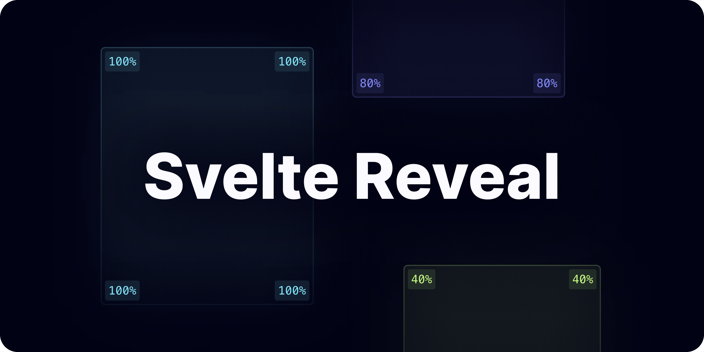

> ⚠️ **This package has been sunset**
> Svelte Reveal is no longer actively maintained. The final release is version **1.2.0**. Please see the [package README](./packages/svelte-reveal/README.md) for context and recommended alternatives.

# Svelte Reveal

  

Svelte Reveal is a library created with the purpose of helping [Svelte](https://svelte.dev/) users add reveal on scroll animations to their web applications in the easiest way possible. This library leverages the [Intersection Observer API](https://developer.mozilla.org/en-US/docs/Web/API/Intersection_Observer_API) in order to know when to trigger the animations.

## Features

- ⚡️ Near zero config
- 👀 Intersection Observer API
- 🧩 Customizable transitions
- 🔌 Extensive API
- 📚 Exhaustive documentation
- 🔥 100% TypeScript

## Documentation

You can find full documentation on [svelte-reveal.vercel.app](https://svelte-reveal.vercel.app/).

## Monorepo

| Name                                            | Purpose | Description                                                  |
| ----------------------------------------------- | ------- | ------------------------------------------------------------ |
| [svelte-reveal](./packages/svelte-reveal)       | package | The Svelte action that gets published on NPM                 |
| [with-svelte-vite](./examples/with-svelte-vite) | example | Basic example project on how to use Svelte Reveal with Svelte + Vite |
| [with-sveltekit](./examples/with-sveltekit)     | example | Basic example project on how to use Svelte Reveal with SvelteKit |

## Troubleshooting

Feel free to [open a new issue](https://github.com/DaveKeehl/svelte-reveal/issues/new/choose) in case of any problems.

## Funding

[Want to buy me a coffee?](https://ko-fi.com/davekeehl)

## Versioning

This project uses [Semantic Versioning](https://semver.org/) to keep track of its version number.

## Changelog

[CHANGELOG](./packages/svelte-reveal/CHANGELOG.md)

## License

[MIT](./LICENSE)
